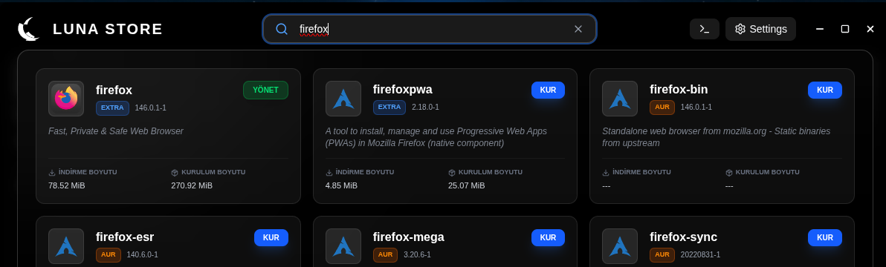
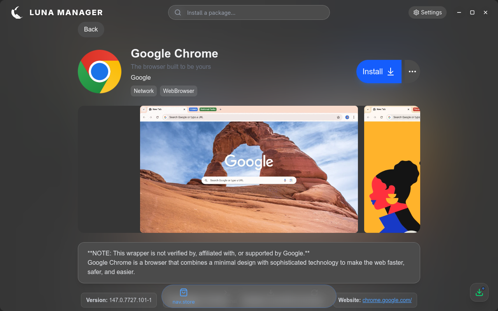
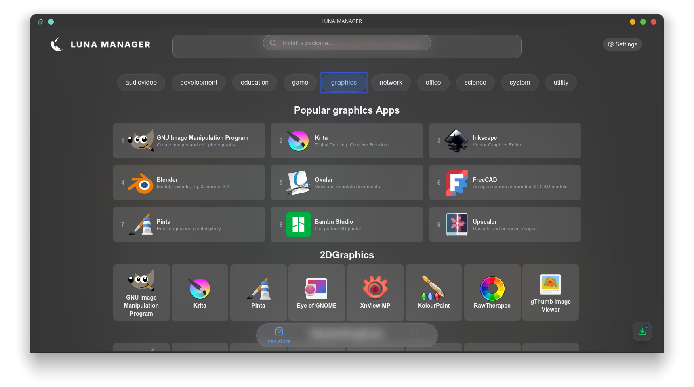

  

<h1 align="center">Luna Manager</h1>

<i>A modern package manager for Linux, built with Rust (Tauri).</i>

  
  

---

> [!IMPORTANT]
> ### 🚧 REPOSITORY UNDER DEVELOPMENT
> **Luna Manager** is currently in the initial stages of development. The current repository contains the foundational structure but remains mostly empty at this time. Functional components and usable features will be published as they reach a deployable state.
> 
> **Follow the repository** to stay updated on the latest progress!

> [!WARNING]
> **REWRITTEN FROM SCRATCH:** Due to the excessive memory (RAM) usage of the legacy Electron version, the project is being completely rewritten in **Rust and Tauri** for peak efficiency and native performance.

  <b><a href="https://luna.herzane.tr">Official Website</a> • <a href="https://github.com/herzane52/luna-store-electron">Legacy Electron Version</a></b>

---

### 📸 Screenshot

  
    
  

---

  <b>📜 Open Source & License</b>
   
  This project is distributed under the <b>GPL-3.0 License</b>. Any projects based on this source code must also be released as open source under the same GPL license terms.
   
  <i>For more details, please check the <a href="LICENSE">GPL-3.0 License</a>.</i>

---

  <b>Support the Project</b>
   
  If you like this project and want to support its development, you can consider becoming a sponsor. 
   
  Your support helps keep the development active and motivated!
    
  

  <i>With love to the Linux community. ❤️</i>

